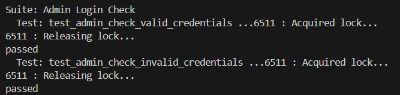
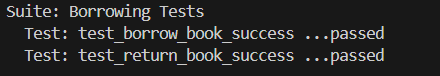
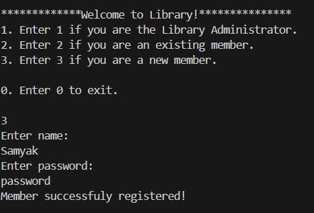

# ShelfWare Library Management System

The Online Library Management System (OLMS) is built using system calls to perform diverse tasks such as managing processes, handling files, implementing file locking, managing multithreading, and facilitating interprocess communication. Socket programming is employed to establish client-server communication, enabling concurrent access to the library database by multiple clients.

## Server:

Implemented in library_server.c, the code handles multiple clients at a time (using multi-threading). All the requests received from the clients have a specific Request Number, that enables the server to identify the type of operation to be performed.

Mutex based locking ensures any clashes when several clients try to access the same file/resource.

## Client:

Implemented in library_client.c, the code provides a menu-based interface for the members/admin. Depending on the operation to be performed, a request is generated (that starts with the Request Number), and sent over to the server through the socket.

### admin_login.txt

Stores login credentials for the admin.

### books.txt

Stores the details of the books in the library: (BookID, Book Name, Author, Number of Copies).

### borrowed_books.txt

Stores the transaction details for each book that is borrowed: (BookID, Username)

### logins.txt

Stores the login details for each member of library.

## Unit Testing
The provided code performs unit testing for a library management system using the CUnit testing framework. It ensures the functionality of various modules, including admin operations, book management, member management, and borrowing/returning books. 

Below given is the description for each test suite:

### Admin Tests

1. **`test_admin_check_valid_credentials()`**  
   Tests whether valid admin credentials are correctly recognized by the `admin_check` function.

2. **`test_admin_check_invalid_credentials()`**  
   Tests whether invalid admin credentials are correctly rejected by the `admin_check` function.

---

### Book Management Tests

3. **`test_add_new_book()`**  
   Tests the functionality of adding a new book to the system by checking if the book details are correctly written to `books.txt`.

4. **`test_remove_book_found()`**  
   Tests the removal of a book that exists in the system, expecting success.

5. **`test_remove_book_not_found()`**  
   Tests the removal of a book that does not exist in the system, expecting failure.

6. **`test_search_book_found()`**  
   Tests searching for a book that exists, expecting success.

7. **`test_search_book_not_found()`**  
   Tests searching for a book that does not exist, expecting failure.

8. **`test_modify_book_count_success()`**  
   Tests modifying the count of a book that exists in the system, expecting success.

9. **`test_modify_book_count_failure()`**  
   Tests modifying the count of a book that does not exist, expecting failure.

10. **`test_display_books_non_empty()`**  
    Tests displaying the list of books when there are entries in the database, expecting success.

11. **`test_display_books_empty()`**  
    Tests displaying the list of books when the database is empty, expecting failure.

---

### Member Management Tests

12. **`test_add_member_success()`**  
    Tests adding a new member with valid credentials, expecting success.

13. **`test_add_member_failure()`**  
    Tests adding a new member with invalid or empty input, expecting failure.

14. **`test_login_member_success()`**  
    Tests logging in with valid member credentials, expecting success.

15. **`test_login_member_failure()`**  
    Tests logging in with invalid credentials, expecting failure.

16. **`test_remove_member_success()`**  
    Tests removing a member who exists in the system, expecting success.

17. **`test_remove_member_failure()`**  
    Tests removing a member who does not exist, expecting failure.

18. **`test_display_members_non_empty()`**  
    Tests displaying the list of members when there are entries, expecting success.

19. **`test_display_members_empty()`**  
    Tests displaying the list of members when the database is empty, expecting failure.

---

### Borrowing and Returning Tests

20. **`test_borrow_book()`**  
    Tests borrowing a book by decrementing its count in `books.txt` and adding an entry to `borrowed_books.txt`.

21. **`test_return_book()`**  
    Tests returning a borrowed book by incrementing its count in `books.txt` and removing the corresponding entry from `borrowed_books.txt`.

---

## Program Execution Workflow:

On the terminal running client side we have options to login as admin or member :
---
### logging in as Admin :

User enters 1 (code for user to login as admin )

User then enters Username and password .

A menu to do multiple operations along with their codes is displayed . The user enters code according to which operation the user wishes to perform .
The user is then prompted to give inputs according to each operation accordingly.

---
### logging in as Member :

User enters 2 (code for user to login as member)

User then enters Username and password .

A menu to do multiple operations along with their codes is displayed . The user enters code according to which operation the user wishes to perform .
The user is then prompted to give inputs according to each operation accordingly.

---
### Signing up as Member :

User enters 3 (code for user to sign up as a member)

User then enters Username and password .

A menu to do multiple operations along with their codes is displayed . The user enters code according to which operation the user wishes to perform .
The user is then prompted to give inputs according to each operation accordingly.

---

## Steps to Run the Project:

Command to run on first terminal:

gcc library_server.c -o server

./server

Command to run on second terminal:

gcc library_client.c -o client

./client

---

## Steps for testing:

clone the repo and make sure all text files except admin_login.txt are empty.

command to run on terminal:

For intallation of Cunit:

sudo apt-get install libcunit1 libcunit1-doc libcunit1-dev|

sudo apt install pkg-config

pkg-config --modversion cunit

For Compiling and running test file:

gcc -DTESTING server_test.c library_server.c -o server_test -lcunit

./server_test

